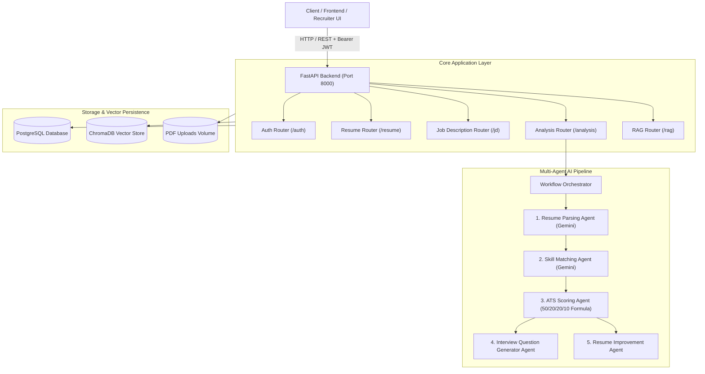

# Agentic AI Recruitment Assistant 🚀

A production-ready, enterprise-grade AI Recruitment Platform built with **FastAPI**, **PostgreSQL**, **SQLAlchemy**, **JWT Authentication**, **Google Gemini API**, **LangChain**, and **ChromaDB**.

The platform automates the end-to-end talent evaluation pipeline: extracting structured candidate profiles from unstructured PDF resumes, performing semantic skill matching against target Job Descriptions, calculating weighted ATS scores, generating tailored multi-category interview questions, providing actionable resume enhancement feedback, and offering RAG-powered vector search across candidates and job postings.

---

## 🏛️ System Architecture



---

## ⚡ Multi-Agent Workflow Execution Flow

```
Resume Upload (PDF)
       ↓
[1. Resume Parsing Agent]  ──> Extracts: Name, Email, Phone, Skills, Projects, Education, Experience
       ↓
[2. Skill Matching Agent]   ──> Computes match % and categorizes Matched vs Missing Skills
       ↓
[3. ATS Scoring Agent]      ──> Calculates: Skill (50%) + Projects (20%) + Exp (20%) + Edu (10%)
       ↓
 ┌────────────────────────────────────────┐
 │ Concurrent Multi-Agent Generation      │
 │  ├── [4. Interview Question Generator] │ ──> Technical, Project, Behavioral, & HR Questions
 │  └── [5. Resume Improvement Agent]     │ ──> Missing Skills, Action Verbs, ATS Keywords, Metrics
 └────────────────────────────────────────┘
       ↓
[Final Comprehensive Analysis Report] ──> Persisted in PostgreSQL & Indexed in ChromaDB
```

---

## 🛠️ Technology Stack

| Component | Technology | Description |
|---|---|---|
| **Framework** | FastAPI 0.111+ | High performance async ASGI framework |
| **Language** | Python 3.12 | Modern typing and runtime optimizations |
| **Database** | PostgreSQL 16 | ACID-compliant relational data store |
| **ORM** | SQLAlchemy 2.0 | Declarative mapped relational models |
| **Migrations** | Alembic | Database schema versioning |
| **Auth & Security** | JWT (jose) + Passlib (bcrypt) | Secure token authentication & password hashing |
| **AI & LLM** | Google Gemini API (`gemini-1.5-flash`) | Structured JSON generation & reasoning |
| **Vector Database** | ChromaDB Persistent Client | High-performance embedding index |
| **RAG & Embeddings** | LangChain + `text-embedding-004` | Semantic similarity & context retrieval |
| **PDF Extraction** | PyPDF + PDFPlumber | Multi-page text extraction engine |
| **Containerization** | Docker & Docker Compose | Multi-container production deployment |

---

## 🚀 Quick Start with Docker Compose

### 1. Clone & Configure Environment
```bash
cp .env.example .env
```
Edit `.env` and set your `GEMINI_API_KEY`:
```env
GEMINI_API_KEY=AIzaSy...your_gemini_api_key...
```

### 2. Launch with Docker Compose
```bash
docker-compose up --build -d
```

### 3. Verify Health & Access Swagger UI
- Interactive Swagger UI: [http://localhost:8000/docs](http://localhost:8000/docs)
- Alternative ReDoc: [http://localhost:8000/redoc](http://localhost:8000/redoc)
- Health Check: [http://localhost:8000/health](http://localhost:8000/health)

---

## 💻 Local Manual Setup

### 1. Create and Activate Virtual Environment
```bash
python -m venv venv
# On Windows:
.\venv\Scripts\activate
# On Linux/macOS:
source venv/bin/activate
```

### 2. Install Dependencies
```bash
pip install --upgrade pip
pip install -r requirements.txt
```

### 3. Initialize Database & Seed Sample Data
```bash
python init_db.py
```

### 4. Run Migrations (Optional / Automated)
```bash
alembic upgrade head
```

### 5. Start Development Server
```bash
uvicorn main:app --host 0.0.0.0 --port 8000 --reload
```

---

## 🔑 Default Seeded Accounts

| Role | Email | Password |
|---|---|---|
| **Admin** | `admin@recruitmentai.com` | `AdminSecurePass123!` |
| **Recruiter** | `recruiter@recruitmentai.com` | `RecruiterPass123!` |

---

## 📚 API Endpoints Specification & Sample Requests

### 1. Authentication

#### `POST /api/v1/auth/register`
**Request Body:**
```json
{
  "name": "Jane Candidate",
  "email": "jane.candidate@example.com",
  "password": "SecurePassword123!",
  "role": "candidate"
}
```
**Response (201 Created):**
```json
{
  "success": true,
  "message": "User registered successfully.",
  "data": {
    "name": "Jane Candidate",
    "email": "jane.candidate@example.com",
    "role": "candidate",
    "id": 3,
    "is_active": true,
    "created_at": "2026-09-28T12:00:00Z",
    "updated_at": "2026-09-28T12:00:00Z"
  }
}
```

#### `POST /api/v1/auth/login`
**Request Body:**
```json
{
  "email": "jane.candidate@example.com",
  "password": "SecurePassword123!"
}
```
**Response (200 OK):**
```json
{
  "access_token": "eyJhbGciOiJIUzI1NiIsInR5cCI6IkpXVCJ9...",
  "token_type": "bearer",
  "user": {
    "name": "Jane Candidate",
    "email": "jane.candidate@example.com",
    "role": "candidate",
    "id": 3,
    "is_active": true,
    "created_at": "2026-09-28T12:00:00Z",
    "updated_at": "2026-09-28T12:00:00Z"
  }
}
```

---

### 2. Resume Management

#### `POST /api/v1/resume/upload`
- Multipart form upload with `file: <resume.pdf>`.
- Header: `Authorization: Bearer <token>` (Optional)

**Response (201 Created):**
```json
{
  "success": true,
  "message": "Resume uploaded and parsed successfully by ResumeAgent.",
  "data": {
    "id": 1,
    "user_id": 3,
    "file_name": "jane_doe_resume.pdf",
    "file_path": "./uploads/20260928_120000_jane_doe_resume.pdf",
    "extracted_text": "Jane Doe\nSenior Backend Developer...",
    "parsed_data": {
      "name": "Jane Doe",
      "email": "jane.doe@email.com",
      "phone": "+1-555-0199",
      "skills": ["Python", "FastAPI", "PostgreSQL", "Docker", "SQLAlchemy", "Redis"],
      "projects": [
        {
          "title": "High-Throughput Payment Engine",
          "technologies": ["FastAPI", "PostgreSQL", "Redis", "Docker"],
          "description": "Engineered payment processing pipeline handling 5,000 requests/sec with 99.99% uptime."
        }
      ],
      "education": [
        {
          "degree": "B.S. in Computer Science",
          "institution": "Stanford University",
          "year": "2018 - 2022",
          "grade": "3.9 GPA"
        }
      ],
      "experience": [
        {
          "company": "Tech Corp",
          "role": "Senior Backend Engineer",
          "duration": "2022 - Present",
          "responsibilities": [
            "Architected scalable RESTful microservices in FastAPI.",
            "Optimized PostgreSQL connection pool reducing query latencies by 35%."
          ]
        }
      ],
      "summary": "Experienced Backend Engineer specializing in Python, high-throughput microservices, and database optimization."
    },
    "created_at": "2026-09-28T12:00:00Z",
    "updated_at": "2026-09-28T12:00:00Z"
  }
}
```

---

### 3. Job Description Management

#### `POST /api/v1/jd/create`
**Request Body:**
```json
{
  "title": "Lead FastAPI / Cloud Architect",
  "required_skills": ["Python", "FastAPI", "PostgreSQL", "Docker", "Kubernetes", "AWS", "Redis"],
  "jd_text": "We are looking for a Lead FastAPI and Cloud Architect to design cloud-native microservices..."
}
```

---

### 4. Multi-Agent Recruitment Analysis

#### `POST /api/v1/analysis/run`
**Request Body:**
```json
{
  "resume_id": 1,
  "jd_id": 1
}
```

**Response (201 Created):**
```json
{
  "success": true,
  "message": "Multi-Agent recruitment analysis completed successfully.",
  "data": {
    "id": 1,
    "resume_id": 1,
    "jd_id": 1,
    "ats_score": 87.5,
    "match_percentage": 85.7,
    "report_json": {
      "candidate_name": "Jane Doe",
      "job_title": "Lead FastAPI / Cloud Architect",
      "ats_score": 87.5,
      "match_percentage": 85.7,
      "skill_match": {
        "match_percentage": 85.7,
        "matched_skills": ["Python", "FastAPI", "PostgreSQL", "Docker", "Redis", "SQLAlchemy"],
        "missing_skills": ["Kubernetes", "AWS"],
        "strong_skills": ["FastAPI", "PostgreSQL", "Python"],
        "analysis_notes": "Candidate exhibits strong core competency in backend development with minor cloud infrastructure gaps."
      },
      "ats_breakdown": {
        "ats_score": 87.5,
        "skill_match": {
          "score": 85.7,
          "weight": 50.0,
          "weighted_score": 42.85,
          "reasoning": "Strong match across primary languages and backend frameworks."
        },
        "projects": {
          "score": 90.0,
          "weight": 20.0,
          "weighted_score": 18.0,
          "reasoning": "Demonstrates enterprise-grade payment engine and high-concurrency systems."
        },
        "experience": {
          "score": 90.0,
          "weight": 20.0,
          "weighted_score": 18.0,
          "reasoning": "Directly relevant Senior Backend experience with measurable outcomes."
        },
        "education": {
          "score": 86.5,
          "weight": 10.0,
          "weighted_score": 8.65,
          "reasoning": "Top tier B.S. in Computer Science."
        },
        "overall_summary": "Exceptional candidate recommended for technical interview round."
      },
      "interview_questions": {
        "technical_questions": [
          "How do you handle asynchronous database sessions with SQLAlchemy 2.0 and connection pooling under heavy load?",
          "What mechanisms do you employ to prevent race conditions during distributed transaction workflows?"
        ],
        "project_questions": [
          "In your High-Throughput Payment Engine, how did you architect idempotency and fallback retries?",
          "How did you monitor latency percentiles (p95/p99) across microservice boundaries?"
        ],
        "behavioral_questions": [
          "Describe how you navigated a major breaking schema migration with zero downtime in production.",
          "Tell us about a time you mentored engineers on asynchronous programming patterns."
        ],
        "hr_questions": [
          "What architectural challenges are you most looking forward to tackling next?",
          "What is your notice period and compensation structure preference?"
        ]
      },
      "improvements": {
        "missing_skills_suggestions": [
          "Attain AWS Certified Solutions Architect or demonstrate AWS deployments in portfolio.",
          "Add Kubernetes manifest configurations (Helm/Kustomize) to showcase orchestration skills."
        ],
        "resume_enhancement_suggestions": [
          "Incorporate quantifiable metrics for database query latency reductions.",
          "Standardize bullet points using strong action verbs (Engineered, Architected, Spearheaded)."
        ],
        "keyword_optimization_suggestions": [
          "Add 'Distributed Systems' and 'CI/CD Pipelines' to core summary.",
          "Explicitly mention 'Kubernetes Cluster Management' under relevant projects."
        ],
        "project_improvement_suggestions": [
          "Include public GitHub links and architecture diagrams for your payment engine.",
          "Add benchmarks detailing throughput metrics and memory footprint."
        ]
      }
    },
    "created_at": "2026-09-28T12:05:00Z"
  }
}
```

---

### 5. RAG & Semantic Vector Search

#### `POST /api/v1/rag/search-resumes`
**Request Body:**
```json
{
  "query": "FastAPI engineer with PostgreSQL and Redis payment processing experience",
  "top_k": 5
}
```
**Response (200 OK):**
```json
{
  "success": true,
  "message": "Found 1 relevant candidate resumes.",
  "data": {
    "query": "FastAPI engineer with PostgreSQL and Redis payment processing experience",
    "total_results": 1,
    "results": [
      {
        "resume_id": 1,
        "candidate_name": "Jane Doe",
        "similarity_score": 0.942,
        "snippet": "Jane Doe\nSenior Backend Developer\nHigh-Throughput Payment Engine...",
        "skills": ["Python", "FastAPI", "PostgreSQL", "Docker", "Redis"]
      }
    ]
  }
}
```

---

## 🧪 Testing and Verification

Run the test suite or verify endpoints locally:
```bash
curl -X GET http://localhost:8000/health
```

---

## 📄 License
MIT License. Built for Enterprise Recruitment Automation.
